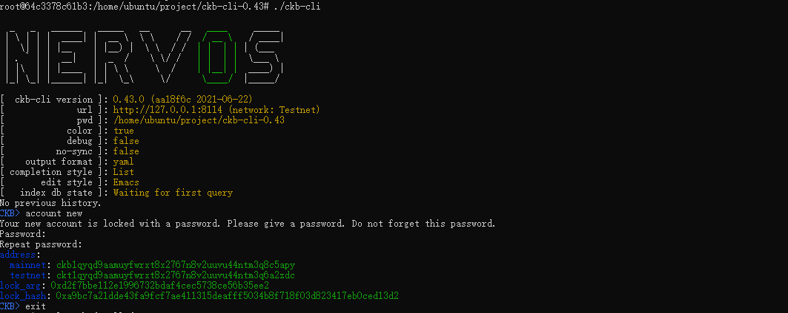
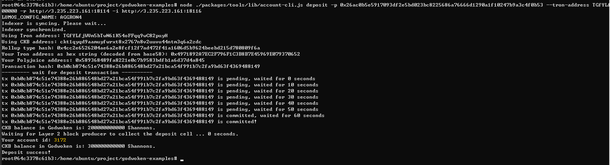
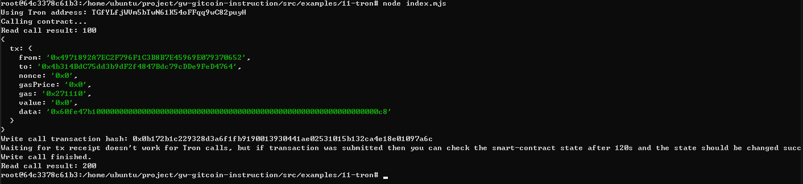

# Gitcoin: 11) Use A Tron Wallet To Execute A Smart Contract Call
## 1.A screenshot of the accounts you created (account list) in ckb-cli.

## 2.A link to the Layer 1 address you funded on the Testnet Explorer.
https://explorer.nervos.org/aggron/address/ckt1qyqd9aamuyfwrxt8x2767n8v2uuvu44ntm3q6a2zdc
## 3.A screenshot of the console output immediately after you have successfully submitted a CKByte deposit to your Tron account on Layer 2.

## 4.A screenshot of the console output immediately after you have successfully issued a smart contract calls on Layer 2.

## 5.The transaction hash of the "Contract call" from the console output (in text format).
`0x0b172b1c229328d3a6f1fb9190013930441ae02531015b132ca4e18e01097a6c`
## 6.The contract address that you called (in text format).
`0x4b314BdC75dd3b9dF2f4847Bdc79cDDe9FeD4764`
## 7.The ABI for contract you made a call on (in text format).
```
[
	{
		"inputs": [],
		"stateMutability": "payable",
		"type": "constructor"
	},
	{
		"inputs": [],
		"name": "get",
		"outputs": [
			{
				"internalType": "uint256",
				"name": "",
				"type": "uint256"
			}
		],
		"stateMutability": "view",
		"type": "function"
	},
	{
		"inputs": [
			{
				"internalType": "uint256",
				"name": "x",
				"type": "uint256"
			}
		],
		"name": "set",
		"outputs": [],
		"stateMutability": "payable",
		"type": "function"
	}
]
```
  
## 8.Your Tron address (in text format).
`TGfYLfjWVm5bTwN61K54oFFqq9wC82puyH`

