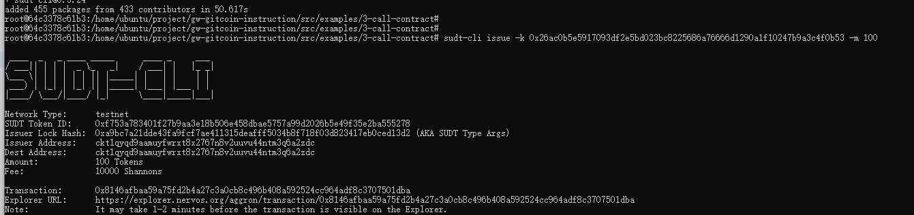
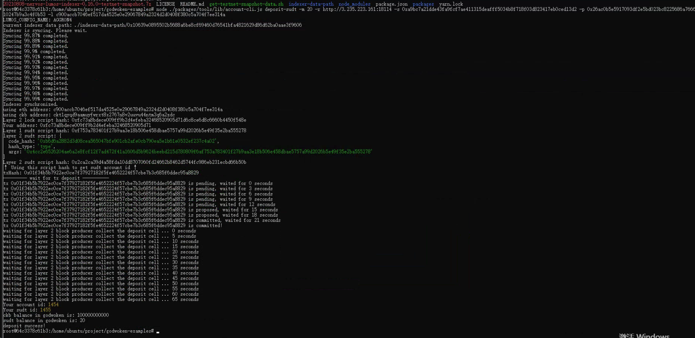

# Gitcoin: 4) Issue An SUDT Token On Layer 1 And Deposit It To Layer 2

## 1. A link to the Layer 1 address you funded on the Testnet Explorer.

https://explorer.nervos.org/aggron/address/ckt1qyqd9aamuyfwrxt8x2767n8v2uuvu44ntm3q6a2zdc

## 2. A screenshot of the console output immediately after using sudt-cli to create your SUDT tokens on Layer 1.




## 3. A link to the transaction ID created by sudt-cli on the Testnet Explorer.

https://explorer.nervos.org/aggron/transaction/0x8146afbaa59a75fd2b4a27c3a0cb8c496b408a592524cc964adf8c3707501dba

## 4. A screenshot of the console output immediately after you have successfully submitted a deposit to Layer 2 using the account-cli tool.



## 5. The SUDT ID from the console output after executing the deposit script (in text format).

```Your sudt id: 1455```


