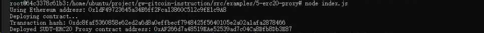
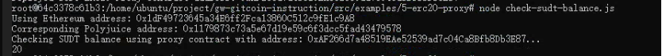

Gitcoin: 5) Deploy The ERC20 Proxy Contract For The Deposited SUDT

## A screenshot of the console output immediately after deploying smart contract.



## 2. The address of the ERC20 Proxy Contract you deployed (in text format).

```0xAF266d7a48519EAe52539ad7c04Ca8Bfb8Db3E87```


## 3. A screenshot of the console output immediately after checking your SUDT balance.



## 4.The Ethereum address that was checked (in text format).
```0xAF266d7a48519EAe52539ad7c04Ca8Bfb8Db3E87```

