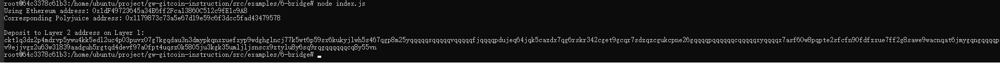

Gitcoin: 6) Use Force Bridge To Deposit Tokens From Ethereum To Polyjuice

## 1. A screenshot of the console output immediately after you have successfully generated your Deposit Receiver Address.



## 2. Your Deposit Receiver Address (in text format).

```ckt1q3vvtay34wndv9nckl8hah6fzzcltcqwcrx79apwp2a5lkd07fdxx805ju3kgk35umljljsnscx9ztylu8y6s0kwh88```


## 3. The Ethereum address used to generate the Deposit Receiver Address (in text format).
```0x1dF49723645a34E6ff2Fca13860C512c9fE1c9A8```

## 4. A link to the Etherscan explorer for the successful Force Bridge transaction. This can be found on Force Bridge under History→Succeed.
https://rinkeby.etherscan.io/tx/0xc979b6332858664c8e411dad96cabb03fffa73a81d05908b7a110820b127f461

## 5. A link to the Nervos explorer for the successful Force bridge transaction. This can be found on Force Bridge under History→Succeed.
https://explorer.nervos.org/aggron/address/ckt1q3vvtay34wndv9nckl8hah6fzzcltcqwcrx79apwp2a5lkd07fdxx805ju3kgk35umljljsnscx9ztylu8y6s0kwh88