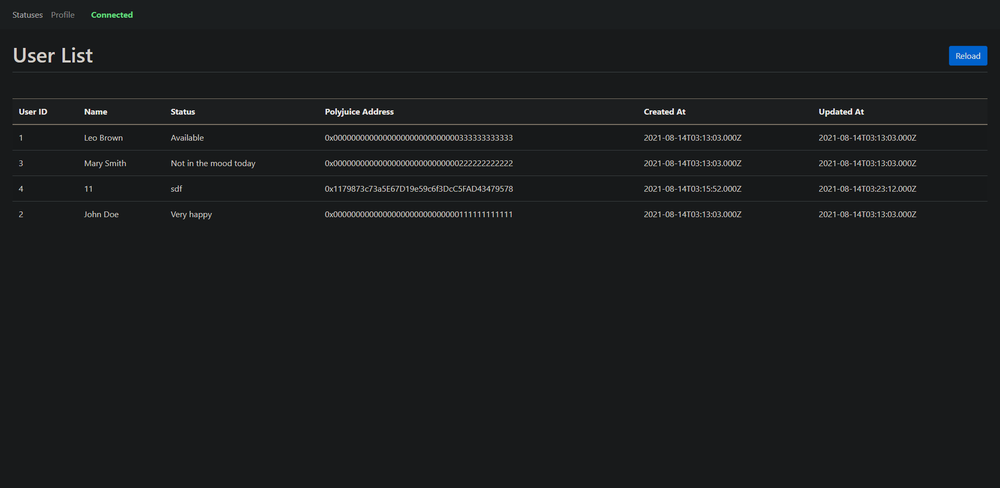
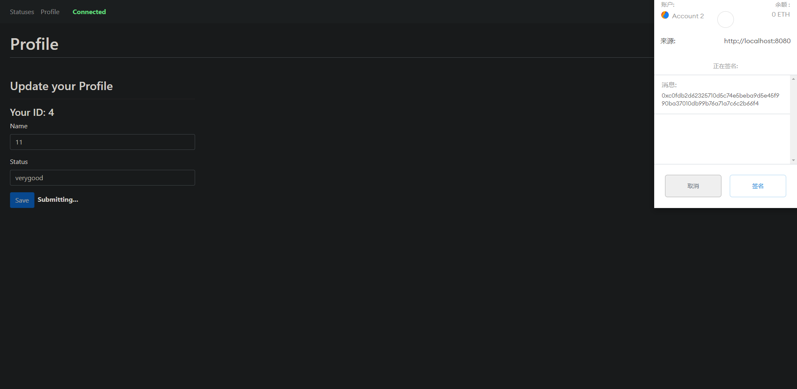

# Nervos-Hakathon-Task-7

1. Screenshots or video of your application running on Godwoken.



2. Link to the GitHub repository with your application which has been ported to Godwoken.

    https://github.com/fsy412/Nervos-Gitcoin-Hackathon/tree/main/task_7/v3port

3. Transaction hash of the deployment transaction.
```
0x890f43e536ef27d0b824b6ee01e4e4c8fb87e6e0c36f706eaa330dd8dc6ffa12
```

4. The deployed contract address.
```
0xF8C499A025dfF3D5A861Ac3A81B49d2237D58Cb9
```

5. ABI of the deployed smart contract.
```
[
		{
			"inputs": [],
			"payable": false,
			"stateMutability": "nonpayable",
			"type": "constructor"
		},
		{
			"anonymous": false,
			"inputs": [
				{
					"indexed": false,
					"internalType": "uint256",
					"name": "id",
					"type": "uint256"
				}
			],
			"name": "newUserRegistered",
			"type": "event"
		},
		{
			"anonymous": false,
			"inputs": [
				{
					"indexed": false,
					"internalType": "uint256",
					"name": "id",
					"type": "uint256"
				}
			],
			"name": "userUpdateEvent",
			"type": "event"
		},
		{
			"constant": true,
			"inputs": [],
			"name": "getOwnProfile",
			"outputs": [
				{
					"internalType": "uint256",
					"name": "",
					"type": "uint256"
				},
				{
					"internalType": "string",
					"name": "",
					"type": "string"
				},
				{
					"internalType": "string",
					"name": "",
					"type": "string"
				},
				{
					"internalType": "address",
					"name": "",
					"type": "address"
				},
				{
					"internalType": "uint256",
					"name": "",
					"type": "uint256"
				},
				{
					"internalType": "uint256",
					"name": "",
					"type": "uint256"
				}
			],
			"payable": false,
			"stateMutability": "view",
			"type": "function"
		},
		{
			"constant": true,
			"inputs": [
				{
					"internalType": "uint256",
					"name": "_id",
					"type": "uint256"
				}
			],
			"name": "getUserById",
			"outputs": [
				{
					"internalType": "uint256",
					"name": "",
					"type": "uint256"
				},
				{
					"internalType": "string",
					"name": "",
					"type": "string"
				},
				{
					"internalType": "string",
					"name": "",
					"type": "string"
				},
				{
					"internalType": "address",
					"name": "",
					"type": "address"
				},
				{
					"internalType": "uint256",
					"name": "",
					"type": "uint256"
				},
				{
					"internalType": "uint256",
					"name": "",
					"type": "uint256"
				}
			],
			"payable": false,
			"stateMutability": "view",
			"type": "function"
		},
		{
			"constant": true,
			"inputs": [],
			"name": "isRegistered",
			"outputs": [
				{
					"internalType": "bool",
					"name": "",
					"type": "bool"
				}
			],
			"payable": false,
			"stateMutability": "view",
			"type": "function"
		},
		{
			"constant": false,
			"inputs": [
				{
					"internalType": "string",
					"name": "_userName",
					"type": "string"
				},
				{
					"internalType": "string",
					"name": "_status",
					"type": "string"
				}
			],
			"name": "registerUser",
			"outputs": [
				{
					"internalType": "uint256",
					"name": "",
					"type": "uint256"
				}
			],
			"payable": false,
			"stateMutability": "nonpayable",
			"type": "function"
		},
		{
			"constant": true,
			"inputs": [],
			"name": "totalUsers",
			"outputs": [
				{
					"internalType": "uint256",
					"name": "",
					"type": "uint256"
				}
			],
			"payable": false,
			"stateMutability": "view",
			"type": "function"
		},
		{
			"constant": false,
			"inputs": [
				{
					"internalType": "string",
					"name": "_newUserName",
					"type": "string"
				},
				{
					"internalType": "string",
					"name": "_newStatus",
					"type": "string"
				}
			],
			"name": "updateUser",
			"outputs": [
				{
					"internalType": "uint256",
					"name": "",
					"type": "uint256"
				}
			],
			"payable": false,
			"stateMutability": "nonpayable",
			"type": "function"
		},
		{
			"constant": true,
			"inputs": [
				{
					"internalType": "uint256",
					"name": "",
					"type": "uint256"
				}
			],
			"name": "users",
			"outputs": [
				{
					"internalType": "string",
					"name": "name",
					"type": "string"
				},
				{
					"internalType": "string",
					"name": "status",
					"type": "string"
				},
				{
					"internalType": "address",
					"name": "walletAddress",
					"type": "address"
				},
				{
					"internalType": "uint256",
					"name": "createdAt",
					"type": "uint256"
				},
				{
					"internalType": "uint256",
					"name": "updatedAt",
					"type": "uint256"
				}
			],
			"payable": false,
			"stateMutability": "view",
			"type": "function"
		},
		{
			"constant": true,
			"inputs": [
				{
					"internalType": "address",
					"name": "",
					"type": "address"
				}
			],
			"name": "usersIds",
			"outputs": [
				{
					"internalType": "uint256",
					"name": "",
					"type": "uint256"
				}
			],
			"payable": false,
			"stateMutability": "view",
			"type": "function"
		}
	]
```