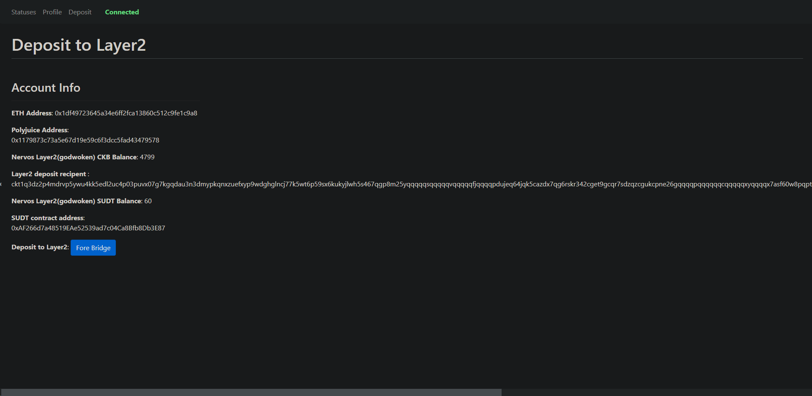

# Task 8) Modify The Ported DApp So It Supports Ethereum Assets Via Force Bridge

1. A screenshot or video of your EVM application on Layer 2 with Force Bridge support.
---


2. The address of the SUDT-ERC20 Proxy Contract that you deployed (in text format).
---
```
0xAF266d7a48519EAe52539ad7c04Ca8Bfb8Db3E87
```

1. A link to the GitHub repository with your EVM application that integrates Force Bridge support.
---

Github Link: https://[https://github.com/fsy412/nervos_task8](https://github.com/fsy412/nervos_task8)