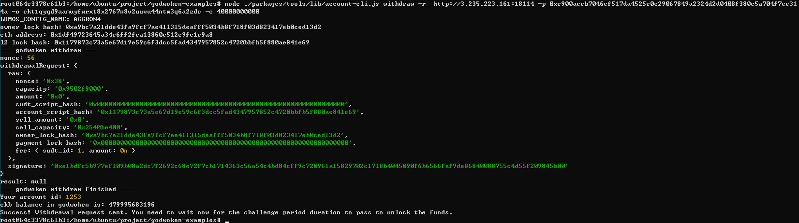

# Gitcoin: 6) Use Force Bridge To Deposit Tokens From Ethereum To Polyjuice

## 1. A screenshot of the console output immediately after running the withdraw command.




## 2. The Ethereum address that you've used for your Layer 2 account (in text format).

```0x1dF49723645a34E6ff2Fca13860C512c9fE1c9A8```


## 3. The Nervos Layer 1 address that you passed to withdraw command (in text format).
```ckt1qyqd9aamuyfwrxt8x2767n8v2uuvu44ntm3q6a2zdc```